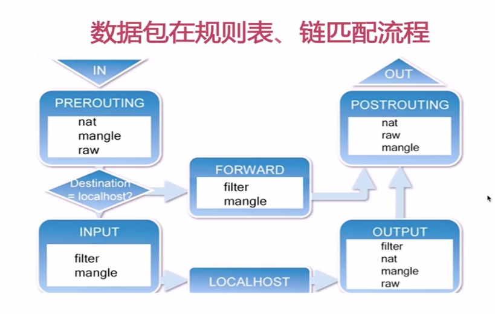

<!--
 * @Author: jangrui
 * @Date: 2019-07-02 21:40:50
 * @LastEditors: jangrui
 * @LastEditTime: 2019-08-22 20:18:09
 * @version: 
 * @Descripttion: 
 -->
# iptables

linux 的防火墙由 netfilter 和 iptables 组成。用户空间的 iptables 制定防火墙规则，内核空间的 netfilter 实现防火墙功能。

netfilter（内核空间位于 Linux 内核中的包过滤防火墙功能体系，称为 Linux 防火墙的“内核态”。

iptables (用户空间)位于 `/sbin/iptables`，是用来管理防火墙的命令的工具，为防火墙体系提供过滤规则/策略，决定如何过滤或处理到达防火墙主机的数据包，称为 Linux 防火墙的“用户态”。

## 四表五链

- 四表：nat、filter、mangle、raw

- 五链：INPUT、OUTPUT、FORWARD、PREROUTING、POSTROUTING

### 四表

常用的 nat 表和 filter 表

- `filter`: 负责过滤功能，内核模块：iptables_filter ; 包含三个链：INPUT、FORWARD、OUTPUT

- `nat`: 用于网络地址（IP、Port）转换，内核模块 iptable_nat；包含三个链：PREROUTING、POSTROUTING、OUTPUT

- `mangle`: 拆解报文，做出修改，并重新封装的功能，修改数据包的服务类型、TTL、并且可以配置路由实现 QOS，内核模块：iptable_mangle;包含五个链：PREROUTING、POSTROUTING、INPUT、OUTPUT、FORWARD；

- `raw`: 优先级最高，一般是为了不再让iptables做数据包的链接跟踪处理，提高性能；包含两个链：OUTPUT、PREROUTING。

### 五链

- `PREROUTING`: 流入的数据包进入路由表之前

- `INPUT`: 通过路由表判断后目的地是本机，然后进入本机内部资源

- `FORWARD`: 通过路由表判断后目的地不是本机，然后通过路由转发到其他地方

- `OUTPUT`: 由本机产生，向外转发

- `POSTROUTING`: 发送的数据包到达网卡出口之前

### 处理优先级

表之间的优先顺序：

> raw > mangle > nat > filter

规则链之间的优先顺序（分三种情况）：

> `流入本机`: PREROUTING --> INPUT --> 用户空间进程；
>
> `转发数据`：PREROUTING --> FORWARD --> POSTROUTING;
>
> `流出本机`：用户空间进程 --> OUTPUT --> POSTROUTING;

第一种情况：入站数据流向

从外界到达防火墙的数据包，先被 PREROUTING 规则链处理（是否修改数据包地址等），之后会进行路由选择（判断该数据包应该发往何处），如果数据包的目标主机是防火墙本机（比如说 Internet 用户访问防火墙主机中的 web 服务器的数据包），那么内核将其传给 INPUT 链进行处理（决定是否允许通过等），通过以后再交给系统上层的应用程序（比如 Apache 服务器）进行响应。

第二冲情况：转发数据流向

来自外界的数据包到达防火墙后，首先被 PREROUTING 规则链处理，之后会进行路由选择，如果数据包的目标地址是其它外部地址（比如局域网用户通过网关访问 QQ 站点的数据包），则内核将其传递给 FORWARD 链进行处理（是否转发或拦截），然后再交给 POSTROUTING 规则链（是否修改数据包的地址等）进行处理。

第三种情况：出站数据流向

防火墙本机向外部地址发送的数据包（比如在防火墙主机中测试公网 DNS 服务器时），首先被 OUTPUT 规则链处理，之后进行路由选择，然后传递给 POSTROUTING 规则链（是否修改数据包的地址等）进行处理。

### 处理动作

数据包访问控制：

- `ACCEPT`: 允许数据包通过
- `DROP`: 直接丢弃数据包，不给任何回应信息
  - `iptables -A FORWARD -p TCP --dport 22 -j REJECT --reject-with tcp-reset`
- `REJECT`: 拒绝数据包通过，必要时会给数据发送端一个响应的信息。

数据包改写：

- `SNAT`: 源地址转换，解决内网用户用同一个公网地址上网的问题。
  - `iptables -t nat -A POSTROUTING -p tcp-o eth0 -j SNAT --to-source 194.236.50.155-194.236.50.160:1024-32000`
- `MASQUERADE`: 是SNAT的一种特殊形式，适用于动态的、临时会变的ip上。
  - `iptables -t nat -A POSTROUTING -p TCP -j MASQUERADE --to-ports 1024-31000`
- `DNAT`: 目标地址转换。
  - `iptables -t nat -A PREROUTING -p tcp -d 15.45.23.67 --dport 80 -j DNAT --to-destination 192.168.1.1-192.168.1.10:80-100`
- `REDIRECT`: 在本机做端口映射。
  - `iptables -t nat -A PREROUTING -p tcp --dport 80 -j REDIRECT --to-ports 8080`
- `MIRROR`: 镜射封包，也就是将来源 IP 与目的地 IP 对调后，将封包送回，进行完此处理动作后，将会中断过滤程序。
- `QUEUE`: 中断过滤程序，将封包放入队列，交给其它程序处理。透过自行开发的处理程序，可以进行其它应用，例如：计算联机费用……等。
- `RETURN`: 结束在目前规则炼中的过滤程序，返回主规则炼继续过滤，如果把自订规则炼看成是一个子程序，那么这个动作，就相当于提早结束子程序并返回到主程序中。
- `MARK`: 将封包标上某个代号，以便提供作为后续过滤的条件判断依据，进行完此处理动作后，将会继续比对其它规则。
  - `iptables -t mangle -A PREROUTING -p tcp --dport 22 -j MARK --set-mark 2`

信息记录：

- `LOG`: 在/var/log/messages 文件中记录日志信息，然后将数据包传递给下一条规则，也就是说除了记录以外不对数据包做任何其他操作，仍然让下一条规则去匹配。
  - `iptables -A INPUT -p tcp -j LOG --log-prefix "INPUT packets"`

### 组成部分

四张表 + 五条链（Hook point）+ 规则

#### command

|参数|说明|示例|
|-|-|-|
|`-F`|清空规则链|`iptables -F`|
|`-L`|查看规则链|`iptables -L`|
|`-A`|追加规则|`iptables -A INPUT`|
|`-D`|删除规则|`iptables -D INPUT 1`|
|`-R`|修改规则|`iptable -R INPUT 1 -s 192.168.120.0 -j DROP`|
|`-I`|在头部插入规则|`iptables -I INPUT 1 --dport 80 -j ACCEPT`|
|`-L`|查看规则|`iptables -L INPUT`|
|`-N`|新的规则|`iptables -N allowed`|
|`-V`|查看iptables版本|`iptables -V`|
|`-p`|协议（tcp/udp/icmp）|`iptables -A INPUT -p tc`|
|`-s`|匹配原地址，加" ! "表示除这个IP外|`iptables -A INPUT -s 192.168.1.1`|
|`-d`|匹配目的地址|`iptables -A INPUT -d 192.168.12.1`|
|`--sport`|匹配源端口流入的数据|`iptables -A INPUT -p tcp --sport 22`|
|`--dport`|匹配目的端口流出的数据|`iptables -A INPUT -p tcp --dport 22`|
|`-i`|匹配入口网卡流入的数据|`iptables -A INPUT -i eth0`|
|`-o`|匹配出口网卡流出的数据|`iptables -A FORWARD -o eth0`|
|`-j`|要进行的处理动作:DROP(丢弃)，REJECT(拒绝)，ACCEPT(接受)，SANT(基于原地址的转换)|`iptable -A INPUT 1 -s 192.168.120.0 -j DROP`|
|`--to-source`|指定SANT转换后的地址|`iptables -t nat -A POSTROUTING -s 192.168.10.0/24 -j SANT --to-source 172.16.100.1`|
|`-t`|表名(raw、mangle、nat、filter)|`iptables -t nat`|
|`-m`|使用扩展模块来进行数据包的匹配(multiport/tcp/state/addrtype)|`iptables -m multiport`|
