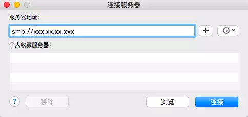
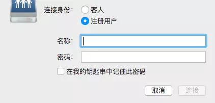

<!--
 * @Author: jangrui
 * @Date: 2019-07-31 07:46:47
 * @LastEditors: jangrui
 * @LastEditTime: 2019-08-22 19:59:35
 * @version: 
 * @Descripttion: Samba
 -->

# SAMBA

Samba 是 SMB/CIFS 网络协议的重新实现, 局域网下可以在 Linux 和 Windows 系统间进行文件、打印机共享，和 NFS 的功能类似。

## 安装 samba

```bash
yum install -y samba
```

## samba 配置参数及作用

```bash
cat /etc/samba/smb.conf
# See smb.conf.example for a more detailed config file or
# read the smb.conf manpage.
# Run 'testparm' to verify the config is correct after
# you modified it.

[global]
    workgroup = SAMBA
    security = user

    passdb backend = tdbsam

    printing = cups
    printcap name = cups
    load printers = yes
    cups options = raw

[homes]
    comment = Home Directories
    valid users = %S, %D%w%S
    browseable = No
    read only = No
    inherit acls = Yes

[printers]
    comment = All Printers
    path = /var/tmp
    printable = Yes
    create mask = 0600
    browseable = No

[print$]
    comment = Printer Drivers
    path = /var/lib/samba/drivers
    write list = @printadmin root
    force group = @printadmin
    create mask = 0664
    directory mask = 0775
```

### 全局参数 [global]

- `workgroup = MYGROUP`: 工作组名称
- `server string = Samba Server Version %v`: 服务器介绍信息，参数%v为显示SMB版本号
- `log file = /var/log/samba/log.%m`: 定义日志文件的存放位置与名称，参数%m为来访的主机名
- `max log size = 50`: 定义日志文件的最大容量为50KB
- `security = user`: 安全验证的方式，总共有4种:
  - `share`: 来访主机无需验证口令；比较方便，但安全性很差
  - `user`: 需验证来访主机提供的口令后才可以访问；提升了安全性
  - `server`: 使用独立的远程主机验证来访主机提供的口令（集中管理账户）
  - `domain`: 使用域控制器进行身份验证
- `passdb backend = tdbsam`: 定义用户后台的类型，共有3种:
  - smbpasswd: 使用smbpasswd命令为系统用户设置Samba服务程序的密码
  - tdbsam: 创建数据库文件并使用pdbedit命令建立Samba服务程序的用户
  - ldapsam: 基于LDAP服务进行账户验证
- `load printers = yes`: 设置在Sam`ba服务启动时是否共享打印机设备
- `cups options = raw`: 打印机的`选项

### 共享参数 [homes]

- `comment = Home Directories`: 描述信息
- `browseable = no`: 指定共享信息是否在“网上邻居”中可见
- `writable = yes`: 定义是否可以执行写入操作，与“read only”相反

### 打印机共享参数 [printers]

- `comment = All Printers`
- `path = /var/spool/samba`: #共享文件的实际路径(重要)。
- `browseable = no`
- `guest ok = no`: 是否所有人可见，等同于"public"参数。
- `writable = no`
- `printable = yes`

## 配置共享资源

1、 创建用于访问共享资源的账户信息。

Samba服务程序默认使用的是用户口令认证模式（user）。这种认证模式可以确保仅让有密码且受信任的用户访问共享资源。且 Samba 服务程序的数据库要求账户必须在当前系统中已经存在。

- `pdbedit`: 用于管理 SMB 服务程序的账户信息数据库。
  - `-a 用户名`: 建立Samba用户
  - `-x 用户名`: 删除Samba用户
  - `-L`: 列出用户列表
  - `-Lv`: 列出用户详细信息的列表

- `smbpasswd`: 属于samba套件，能够实现添加或删除samba用户和为用户修改密码。
  - `-a`: 向smbpasswd文件中添加用户；
  - `-c`: 指定samba的配置文件；
  - `-x`: 从smbpasswd文件中删除用户；
  - `-d`: 在smbpasswd文件中禁用指定的用户；
  - `-e`: 在smbpasswd文件中激活指定的用户；
  - `-n`: 将指定的用户的密码置空。

> 二选一即可。

```bash
pdbedit -a -u jangrui
```

2、 创建共享目录。

> 考虑范围：用户权限、selinux 安全上下文

```bash
mkdir -p /home/share
chown jangrui.jangrui /home/share
yum install -y policycoreutils-python.x86_64
ls -dZ /home/share/
semanage fcontext -at samba_share_t /home/share
restorecon -Rv /home/share/
ls -dZ /home/share/
```

3、 配置 samba

> 考虑范围： 开机启动、防火墙

```bash
cp /etc/samba/smb.conf /etc/samba/smb.conf.bak
cat <<EOF> /etc/samba/smb.conf
[global]
workgroup = SAMBA
server string = Samba Server Version %v
log file = /var/log/samba/log.%m
max log size = 50
security = user
passdb backend = tdbsam
load printers = yes
cups options = raw

[share]
comment = Share file
path = /home/share
public = no
writable = yes
EOF

systemctl restart smb
systemctl enable smb
firewall-cmd --add-service=samba --permanent
firewall-cmd --reload
su - jangrui
echo "this is samba share home" > /home/share/hello.txt
```

## 挂载

### Linux 系统挂载

CIFS 是实现文件共享服务的一种文件系统，主要用于实现windows 系统中的文件共享，linux 系统中与 samba 服务搭配使用。

> 考虑范围： 创建 cifs 认证文件、创建挂载点、开机自动挂载

```bash
yum install -y cifs-utils

cat <<EOF> /home/auth.smb
username=jangrui
password=jangrui
domain=SAMBA
chmod 600 auth.smb
EOF

mkdir /home/samba

cat <<EOF>> /etc/fstab
//192.168.11.130/share /home/samba cifs credentifials=/home/auth.smb 0 0
EOF
mount -a
cat /home/samba/hello.txt
```

### Mac 系统挂载

打开 Finder （或在桌面），按快捷键 `CMD + k` 进入网络邻居，在服务器地址输入 `smb://samba服务器ip` 连接登录即可。





### windows 系统挂载

在 window `运行` 窗口输入 `\\samba服务器ip` 连接登录即可。
